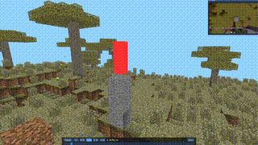

# Blockscope Visualizer

Visualizer made using Python, Pygame and OpenGL



## Introduction

This project is a visualizer for [BlockScope](https://github.com/humboldt123/blockscope) a Minecraft mod for collecting context-rich data to train AI models.

**Note:** You will need to open a Minecraft jar, go into `assets/` and put the `models` folder along with the `textures` folder in the assets directory here. (To be more specific, all you need from the textures directory is the `blocks` and `colormap` directory)

## Prerequisites

Before you can use this program, you need to ensure that you have the following prerequisites installed:

-   Python
-   UV

To install UV, you can use pip:

```sh
pip install uv
```

## Usage

1. Clone this repo.
2. Navigate to the project folder.
3. Install the dependencies

```sh
uv install
```

4. Run the program using UV:

```sh
uv run python src/main.py [path of blockscope recording]
```

## Controls

- **Mouse:** Control the camera's orientation. Move the mouse to look around and explore the game world from different angles.
- **W:** Move forward, advancing in the direction you're facing.
- **A:** Move to the left.
- **D:** Move to the right.
- **S:** Move backward.
- **Space:** Go upward or ascend.
- **Shift:** Go downward or descend.
- **Escape:** Gain control of the cursor
